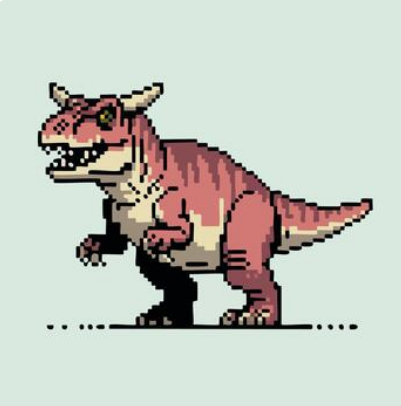

## Hi! I'm Mantaj

- 🎓 As of right now, I'm a 3rd-year computer science student @ Queen's University
- 🖥️ I'm focused on developing my skills as a Full-Stack Developer
- 👩‍🏫 Right now, I'm working on a grocery search assistant web app and exploring IoT concepts through my Raspberry Pi
- 🔭 Fun Fact: I love Dinosaurs and anything to do with paleontology!

  
  

<!--
**MantajToor/MantajToor** is a ✨ _special_ ✨ repository because its `README.md` (this file) appears on your GitHub profile.

Here are some ideas to get you started:

- 🔭 I’m currently working on ...
- 🌱 I’m currently learning ...
- 👯 I’m looking to collaborate on ...
- 🤔 I’m looking for help with ...
- 💬 Ask me about ...
- 📫 How to reach me: ...
- 😄 Pronouns: ...
- ⚡ Fun fact: ...
-->
